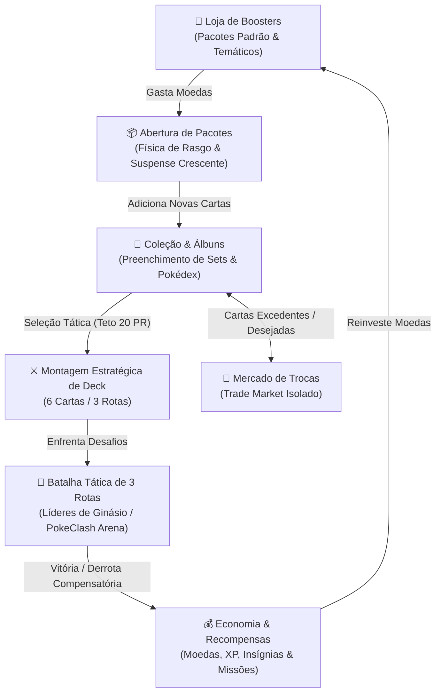

# Game Design Document (GDD) — Pokémon TCG Simulator
## PokeClash Arena & Sistema de Colecionismo Gamificado

> **Versão Oficial:** 2.0.0  
> **Status:** Aprovado & Oficial  
> **Papel Responsável:** Game Designer (Equipe Autônoma de Desenvolvimento)  
> **Repositório:** Pokémon TCG Simulator (`tcg-simulator` / `apps/www`)  
> **Data de Atualização:** 27 de Setembro de 2026  

---

## 1. Visão Geral do Jogo e Pilares de Design

### 1.1. Missão do Projeto
O **Pokémon TCG Simulator** é uma plataforma digital que combina a nostalgia autêntica de colecionar cartas de Pokémon com um sistema ágil, estratégico e moderno de combate tático por rotas (**PokeClash Arena**), economia balanceada com missões diárias, abertura tátil de boosters e mercado de trocas entre treinadores.

### 1.2. Os Quatro Pilares de Game Design
1. **Colecionismo Tátil & Gratificante:** O prazer visceral de abrir boosters físicos é recriado digitalmente por meio de física de rasgo, suspense crescente de revelação de raridades e preenchimento sistemático de álbuns de expansão.
2. **Combate Tático Acessível (Sem a Barreira de 60 Cartas):** Partidas eletrizantes de 2 a 3 minutos baseadas em minidecks de 6 cartas e disputa simultânea em 3 rotas (Lanes), eliminando a necessidade de cartas de energia e linhas evolutivas engessadas do TCG tradicional.
3. **Equilíbrio Competitivo Rígido (Salary Cap Anti-P2W):** Um teto de recrutamento salarial (20 Pontos de Recrutamento) impede que jogadores com mais sorte ou tempo simplesmente enfileirem 6 cartas lendárias, exigindo sinergia, adaptação a terrenos e decisões estratégicas de baixo custo.
4. **Economia Sustentável e Isolamento de Recursos:** Regras rígidas de integridade impedem fraudes ou inconsistências de metagame, garantindo que cartas listadas para troca permaneçam apartadas de decks de combate ativo.

---

## 2. Core Game Loop (Ciclo Central de Jogo)

O fluxo principal do usuário une o consumo de recursos na loja, o desfecho do suspense ao abrir pacotes, a organização da coleção, a montagem estratégica de minidecks e os confrontos contra a IA e outros treinadores:



### 2.1. Estágios Detalhados do Loop

| Estágio | Mecânica Principal | Decisão Estratégica do Jogador |
|---|---|---|
| **1. Loja de Boosters** | Compra de boosters clássicos padrão (12 tiers de preço) ou pacotes temáticos da TCGDex. | Alocar moedas entre pacotes de volume alto de comuns/raras ou poupar para pacotes de alta probabilidade mística. |
| **2. Abertura com Suspense** | Rasgo visual interativo e revelação obrigatória em ordem estritamente crescente de raridade (Tier 1 $\to$ Tier 5). | Antecipação emocional: o "God Pull" ou carta lendária é sempre revelada no clímax do booster. |
| **3. Coleção & Álbuns** | Visualização de cartas em grid 3D holográfico, estatísticas de completude por set e marcação para troca. | Decidir quais cartas manter no cofre pessoal e quais disponibilizar no mercado de trocas. |
| **4. Montagem de Deck** | Seleção de exatamente 6 cartas respeitando o teto de 20 Pontos de Recrutamento (PR). | Equilibrar cartas de alto impacto com suportes econômicos e cobrir fraquezas elementais. |
| **5. Batalha de 3 Rotas** | Confronto nas Rotas Alfa, Beta e Gama com 2 cartas em cada, sob condições climáticas/terrenos dinâmicos. | Alinhamento de tipos aos terrenos, ativação de sinergia de dupla e contra-ataque de vantagens elementais. |
| **6. Recompensas & Missões** | Recompensas progressivas em Moedas e XP, missões diárias (*Daily Road*) e registro de insígnias. | Progresso de nível de conta e acúmulo de capital para reinvestimento na Loja. |
| **7. Trocas entre Treinadores** | Ofertas públicas e privadas entre jogadores com restrição de isolamento. | Obter cartas específicas para completar álbuns ou reforçar rotas deficitárias do deck. |

---

## 3. Regras de Balanceamento e Fórmulas Matemáticas

### 3.1. Teto Salarial de Batalha (Power / Salary Cap de 20 PR)

Para evitar desbalanceamento e a predominância de decks homogêneos ("pay-to-win"), cada composição de batalha deve respeitar rigorosamente um orçamento máximo de **20 Pontos de Recrutamento (PR)** e conter **exatamente 6 cartas de Pokémon**.

#### Tabela Oficial de Custo de Recrutamento (PR por Raridade)

| Tier | Classificação | Custo (PR) | Função Tática no Minideck |
|:---:|:---:|:---:|:---|
| **Tier 1** | Comum | **1 PR** | Peão de sacrifício, carta de sustentação, ativador de sinergia de tipo com baixo custo. |
| **Tier 2** | Rara | **2 PR** | Unidade de linha intermediária sólida, atacante confiável com HP balanceado. |
| **Tier 3** | Épica | **3 PR** | Atacante de alto impacto, Pokémon *ex*, *EX*, *GX* clássicos ou estágio 2. |
| **Tier 4** | Mística | **5 PR** | Titã de rota, Pokémon *VSTAR*, *Tera*, *VMAX*, definidor de vitória na rota principal. |
| **Tier 5** | Lendária / God Pull | **8 PR** | Hiper-carregador de combate (*Finisher* supremo), exige sacrifício de PR no restante do deck. |

#### Restrições Formais de Deck
$$\text{Quantidade de Cartas no Deck} = 6 \quad (\text{Estritamente 2 cartas por Rota})$$
$$\sum_{i=1}^{6} \text{PR}(Card_i) \le 20 \text{ PR}$$

#### Exemplos de Composições de Deck

* **Composição Balanceada (Válida — 19 PR):**
  - 1x Tier 5 (Lendária): 8 PR
  - 1x Tier 4 (Mística): 5 PR
  - 1x Tier 3 (Épica): 3 PR
  - 1x Tier 2 (Rara): 2 PR
  - 2x Tier 1 (Comum): $1 + 1 = 2 \text{ PR}$  
  *Total:* $8 + 5 + 3 + 2 + 1 + 1 = 20 \text{ PR}$ (100% do Cap preenchido).

* **Composição de Especialistas (Válida — 18 PR):**
  - 2x Tier 4 (Mística): $5 + 5 = 10 \text{ PR}$
  - 2x Tier 3 (Épica): $3 + 3 = 6 \text{ PR}$
  - 2x Tier 1 (Comum): $1 + 1 = 2 \text{ PR}$  
  *Total:* $10 + 6 + 2 = 18 \text{ PR}$ (Válido).

* **Composição Inválida (Tentativa de empilhamento de Força Bruta — 30 PR):**
  - 3x Tier 5 (Lendária): $8 \times 3 = 24 \text{ PR}$ (Já excede o limite sozinho!)
  - 3x Tier 2 (Rara): $2 \times 3 = 6 \text{ PR}$  
  *Total:* $30 \text{ PR} > 20 \text{ PR}$ $\to$ **Rejeitado pelo motor de validação.**

---

### 3.2. Cálculo de Poder de Combate (Combat Power - CP Formula)

O Poder de Combate (CP) de cada Pokémon na arena não se limita à sua raridade bruta. O sistema analisa a vitalidade (HP), a complexidade mecânica do monstro expressa no nome da carta, o terreno sorteado para a rota, o companheiro de batalha na mesma linha e a fraqueza do oponente direto.

#### Fórmula Geral do CP

$$\mathbf{CP}_{\text{Total}} = \mathbf{Subtotal} + \mathbf{B\hat{o}nus}_{\text{Terreno}} + \mathbf{B\hat{o}nus}_{\text{Sinergia}} + \mathbf{B\hat{o}nus}_{\text{Vantagem Elemental}}$$

Onde o **Subtotal Aditivo** é composto por:

$$\mathbf{Subtotal} = \mathbf{Base}_{\text{Raridade}} + \mathbf{B\hat{o}nus}_{\text{HP}} + \mathbf{B\hat{o}nus}_{\text{Subtipo}}$$

---

#### 1. Base por Raridade ($\mathbf{Base}_{\text{Raridade}}$)

| Tier | Raridade | Base CP |
|:---:|:---:|:---:|
| 1 | Comum | **25 CP** |
| 2 | Rara | **45 CP** |
| 3 | Épica | **70 CP** |
| 4 | Mística | **100 CP** |
| 5 | Lendária / God Pull | **130 CP** |

*Raridades inválidas ou ausentes adotam fallback seguro de 25 CP.*

---

#### 2. Bônus de HP ($\mathbf{B\hat{o}nus}_{\text{HP}}$)
Para valorizar Pokémon com alta durabilidade (como tanques e evoluções de estágio 2), o HP da carta é multiplicado pelo fator oficial de design:

$$\mathbf{B\hat{o}nus}_{\text{HP}} = \text{round}(\text{HP} \times 2.2)$$

*Exemplos práticos de escalonamento de HP:*
- **Caterpie (40 HP):** $40 \times 2.2 = \mathbf{88 \text{ CP}}$ de bônus de vida.
- **Pikachu (70 HP):** $70 \times 2.2 = \mathbf{154 \text{ CP}}$ de bônus de vida.
- **Charizard ex (220 HP):** $220 \times 2.2 = \mathbf{484 \text{ CP}}$ de bônus de vida.
- **Venusaur VMAX (330 HP):** $330 \times 2.2 = \mathbf{726 \text{ CP}}$ de bônus de vida.

*(Obs: Valores nulos, negativos ou NaN de HP recebem fallback de 0 bônus).*

---

#### 3. Bônus de Subtipo e Formas Especiais ($\mathbf{B\hat{o}nus}_{\text{Subtipo}}$)
Avaliando semântica e sufixos da carta para reconhecer formas especiais:

| Sufixo / Mecânica no Nome | Expressão Regular (Regex) | Bônus CP |
|:---|:---|:---:|
| **Mega Evocações** | `/\b(Mega\|M-)\b/i` ou `/^M\s+/i` | **+35 CP** |
| **VMAX / Tag Team (Duplas)** | `/\b(VMAX\|Tag Team)\b/i` | **+30 CP** |
| **VSTAR / Tera (Cristalização)** | `/\b(VSTAR\|Tera)\b/i` | **+25 CP** |
| **ex / EX / GX** | `/\b(ex\|EX\|GX)\b/i` | **+15 CP** |
| **Radiant (Brilhante) / Pokémon V** | `/\b(Radiant\|V)\b/i` | **+10 CP** |

*(Quando uma carta preenche mais de um critério, prevalece o bônus de maior valor ou combinação de categorias distintas).*

---

#### 4. Bônus de Terreno Elemental (+20% sobre o Subtotal)
Se o tipo elemental primário do Pokémon pertencer à lista de tipos favorecidos da rota sorteada:

$$\mathbf{B\hat{o}nus}_{\text{Terreno}} = \text{round}(\mathbf{Subtotal} \times 0.20)$$

#### Catálogo Oficial de Terrenos de Batalha:

| ID | Nome do Terreno | Tipos Favorecidos | Descrição Temática |
|---|---|---|---|
| `volcano` | **Vulcão Ativo** | `Fire`, `Dragon` | Rios de magma e calor vulcânico amplificam ataques de chamas e dragões ancestrais. |
| `ocean` | **Abismo Marinho** | `Water`, `Lightning` | Turbilhões e alta condutividade salina favorecem correntes de água e descargas elétricas. |
| `jungle` | **Floresta Ancestral** | `Grass` | Copas densas e energia botânica alimentam Pokémon florais e insetos. |
| `psychic_chamber` | **Câmara Psíquica** | `Psychic`, `Darkness` | Dobras no espaço-tempo e névoa sombria potenciam ataques mentais e de trevas. |
| `combat_dojo` | **Dojo de Combate** | `Fighting`, `Metal` | Arena de treino marcial fortificada por chapas de aço, elevando força física e metal. |
| `sky_peak` | **Pico dos Céus** | `Colorless`, `Dragon` | Rajadas de vento ascendente que concedem superioridade aerodinâmica e liberdade a dragões. |

---

#### 5. Bônus de Sinergia de Dupla (+10% sobre o Subtotal)
Na PokeClash Arena, cada rota comporta exatamente 2 cartas aliadas. A sinergia de dupla é ativada quando:
1. Ambas as cartas possuem o **mesmo tipo elemental** (diferente de `none`); **OU**
2. Ambas as cartas pertencem aos **tipos favorecidos pelo terreno da rota**.

$$\mathbf{B\hat{o}nus}_{\text{Sinergia}} = \text{round}(\mathbf{Subtotal} \times 0.10)$$

---

#### 6. Bônus de Vantagem Elemental (+15% sobre o Subtotal)
Se o Pokémon possuir vantagem contra ao menos um dos Pokémon adversários alocados na mesma rota:

$$\mathbf{B\hat{o}nus}_{\text{Vantagem}} = \text{round}(\mathbf{Subtotal} \times 0.15)$$

#### Matriz Canônica de Vantagens (Pokémon TCG Classic):

```
       Atacante ────▶ Vantajoso Contra
       ─────────────────────────────────────────────────────
       Fogo (Fire)       ──▶ Grama, Metal, Inseto, Gelo
       Água (Water)      ──▶ Fogo, Terra, Pedra
       Grama (Grass)     ──▶ Água, Terra, Pedra
       Elétrico (Light)  ──▶ Água, Voador
       Luta (Fighting)   ──▶ Incolor, Escuridão, Metal, Pedra, Normal
       Psíquico (Psychic)──▶ Luta, Veneno
       Escuridão (Dark)  ──▶ Psíquico, Fantasma
       Metal (Metal)     ──▶ Fada, Gelo, Pedra
       Dragão (Dragon)   ──▶ Dragão
```

---

### 3.3. Mecânica de Resolução de Batalha (Lane Warfare)

1. **Alocação de Rotas:** O minideck de 6 cartas do jogador e do Líder de Ginásio é fatiado em 3 pares:
   - **Rota Alfa (Lane 1):** Cartas nos índices $[0, 1]$.
   - **Rota Beta (Lane 2 - Arena Central):** Cartas nos índices $[2, 3]$ *(O terreno desta rota é sempre o terreno preferido do Líder)*.
   - **Rota Gama (Lane 3):** Cartas nos índices $[4, 5]$.
2. **Cálculo de Rota:** O CP total de um lado na rota é a soma dos CPs individuais de suas duas cartas:
   $$\text{CP}_{\text{Rota}} = \text{CP}(Card_A) + \text{CP}(Card_B)$$
3. **Determinação do Vencedor da Rota:**
   - Se $\text{CP}_{\text{Player}} > \text{CP}_{\text{NPC}} \implies \text{Vitória do Jogador na Rota}$ (+1 ponto).
   - Se $\text{CP}_{\text{NPC}} > \text{CP}_{\text{Player}} \implies \text{Vitória do NPC na Rota}$ (+1 ponto).
   - Em caso de empate exato de CP:
     1. Desempate pelo **maior CP individual** entre as cartas da rota.
     2. Desempate secundário pelo **maior HP acumulado** das cartas na rota.
4. **Condição de Vitória na Partida:**
   $$\text{Vitória do Jogador} \iff \text{Pontuação}_{\text{Player}} > \text{Pontuação}_{\text{NPC}} \quad (\text{Melhor de 3 Rotas: 2x0, 2x1 ou 3x0})$$

---

### 3.4. Tabela dos 5 Líderes de Ginásio (Gym Leaders)

Os confrontos do modo Desafio de Ginásio oferecem uma curva de progressão gradual de dificuldade, com decks construídos tematicamente e recompensas econômicas escalonadas:

| Líder de Ginásio | Título & Insígnia | Dificuldade | Terreno Central | Recompensa (Vitória) | Recompensa (Derrota) | Deck Oficial do Líder (6 Cartas) |
|---|---|:---:|:---:|:---:|:---:|---|
| **Brock** | Líder de Pewter<br/>`🪨 Insígnia da Rocha` | **Iniciante**<br/>(Nível 1) | Dojo de Combate<br/>(`combat_dojo`) | **1.500 Moedas**<br/>+150 XP | 225 Moedas<br/>+30 XP | • Geodude (T1, 60 HP, Fighting)<br/>• Kabuto (T1, 70 HP, Fighting)<br/>• Golem ex (T3, 160 HP, Fighting)<br/>• Onix (T2, 110 HP, Fighting)<br/>• Graveler (T2, 90 HP, Fighting)<br/>• Rhyhorn (T2, 80 HP, Fighting) |
| **Misty** | Líder de Cerulean<br/>`💧 Insígnia da Cascata` | **Normal**<br/>(Nível 3) | Abismo Marinho<br/>(`ocean`) | **3.500 Moedas**<br/>+300 XP | 525 Moedas<br/>+60 XP | • Psyduck (T1, 70 HP, Water)<br/>• Golduck (T2, 100 HP, Water)<br/>• Lapras ex (T3, 210 HP, Water)<br/>• Starmie V (T3, 190 HP, Water)<br/>• Staryu (T1, 60 HP, Water)<br/>• Seaking (T2, 90 HP, Water) |
| **Lt. Surge** | O Americano Relâmpago<br/>`⚡ Insígnia do Trovão` | **Desafiador**<br/>(Nível 5) | Abismo Marinho<br/>(`ocean`) | **8.000 Moedas**<br/>+600 XP | 1.200 Moedas<br/>+120 XP | • Voltorb (T1, 60 HP, Lightning)<br/>• Electrode (T2, 90 HP, Lightning)<br/>• Raichu VMAX (T4, 300 HP, Lightning)<br/>• Jolteon ex (T3, 200 HP, Lightning)<br/>• Magneton (T2, 100 HP, Lightning)<br/>• Electabuzz (T2, 100 HP, Lightning) |
| **Erika** | Princesa da Natureza<br/>`🌸 Insígnia do Arco-Íris` | **Difícil**<br/>(Nível 8) | Floresta Ancestral<br/>(`jungle`) | **15.000 Moedas**<br/>+1.000 XP | 2.250 Moedas<br/>+200 XP | • Bellsprout (T1, 60 HP, Grass)<br/>• Victreebel (T2, 130 HP, Grass)<br/>• Venusaur VSTAR (T4, 280 HP, Grass)<br/>• Vileplume GX (T3, 240 HP, Grass)<br/>• Tangela (T2, 80 HP, Grass)<br/>• Gloom (T2, 80 HP, Grass) |
| **Giovanni** | Chefe da Equipe Rocket<br/>`👑 Insígnia da Terra` | **Mestre Supremo**<br/>(Boss Final) | Câmara Psíquica<br/>(`psychic_chamber`) | **40.000 Moedas**<br/>+2.500 XP | 6.000 Moedas<br/>+500 XP | • Kangaskhan ex (T3, 230 HP, Colorless)<br/>• Persian (T2, 100 HP, Colorless)<br/>• Mewtwo VSTAR God Pull (T5, 280 HP, Psychic)<br/>• Nidoqueen (T2, 140 HP, Psychic)<br/>• Nidoking (T2, 150 HP, Psychic)<br/>• Rhydon (T2, 120 HP, Fighting) |

> **Nota de Derrota Compensatória:** Em caso de derrota, o jogador recebe **15% das moedas** e **20% do XP** previstos para honrar o tempo investido e prevenir frustração excessiva, estimulando ajustes finos na composição de deck.

---

### 3.5. Restrição Estrita: Isolamento de Cartas de Troca (`trade_marked_cards`)

Para manter a integridade da economia e impedir condições de corrida assíncronas no banco de dados:

1. **Incompatibilidade Estrita:** Nenhuma carta marcada pelo usuário para disponibilização no Mercado de Trocas (`trade_marked_cards`) pode ser inserida ou mantida em um Deck de Batalha ativo (`user_deck_cards`).
2. **Validação Atômica no Backend:** O serviço `BattleService.saveUserDeck` e `BattleService.fightNpc` efetuam checagem obrigatória contra a tabela `trade_marked_cards`. Caso haja qualquer interseção de `cardId`, a operação é abortada com erro amigável ao usuário.
3. **Sinalização Visual no Frontend:** A interface de seleção de deck deve desabilitar ou exibir um selo de aviso (`badge`) em cartas marcadas para troca, com atalho para desmarcá-las da área comercial caso o jogador deseje recrutá-las para batalha.

---

## 4. Economia de Boosters, Abertura & Prevenção de Inflação

### 4.1. Regra Inegociável de Revelação em Ordem Crescente de Raridade

> **Princípio Psicológico:** No Pokémon TCG físico, o jogador corre as cartas da frente para trás, de modo que o Pokémon holográfico, Ultra Raro ou Secret Rare seja sempre a última carta revelada. O momento de clímax e celebração visual máxima deve ser preservado a qualquer custo.

- Ao abrir qualquer pacote (seja via `/packages/open`, `/packages/buy-many` ou `/packages/thematic-lootbox`), o array de cartas resultante **DEVE** ser ordenado de forma ascendente pela raridade:
  $$\text{Ordem de Exibição: } \text{Tier 1 (Comum)} \longrightarrow \text{Tier 2 (Rara)} \longrightarrow \text{Tier 3 (Épica)} \longrightarrow \text{Tier 4 (Mística)} \longrightarrow \text{Tier 5 (Lendária)}$$
- As animações do modal de abertura do frontend (`pack-opening-modal.tsx`) sincronizam os efeitos de luz, som e confetes de forma progressiva, atingindo o pico na última carta.

---

### 4.2. Catálogo de Boosters da Loja

1. **Pacotes Padrão Clássicos (Exatamente 12 Boosters em Ordem Estrita de Preço):**
   - 1. Pacote Simples: 100 moedas
   - 2. Pacote Raro: 250 moedas
   - 3. Grande Pacote: 600 moedas
   - 4. Pacote Épico: 1.500 moedas
   - 5. Pacote de Iniciação: 3.000 moedas
   - 6. Pacote Lendário: 7.500 moedas
   - 7. Raro de Kanto: 12.000 moedas
   - 8. Grande Épico: 18.000 moedas
   - 9. Tudo ou Nada: 25.000 moedas
   - 10. Vórtice Sombrio: 32.000 moedas
   - 11. Mítico Celestial: 38.000 moedas
   - 12. Tempestade Elemental: 42.000 moedas
2. **Pacotes Temáticos TCGDex:**
   - Boosters correspondentes a cada expansão histórica (Base Set, Scarlet & Violet, 151, Paldea Evolved, etc.) alimentados pela API oficial de metadados.

---

### 4.3. Pacote Temático Personalizado (Custom Thematic Booster)

- **Terminologia Limpa:** O termo "lootbox" está **completamente banido** da interface, rotas públicas e comunicações com o usuário. Utiliza-se exclusivamente **"Pacote Temático Personalizado"**.
- **Teto Obrigatório de Investimento:** O valor depositado deve estar no intervalo fechado de $[500, 1.000.000]$ moedas.
  $$\text{Depósito Mínimo} = 500 \text{ moedas} \quad \big| \quad \text{Teto Máximo} = 1.000.000 \text{ moedas (1M)}$$
- **Fórmula de Volume de Cartas:** O número de cartas geradas ($N$) escala com a raiz quadrada do ouro investido, variando de 3 a 25 cartas:
  $$N_{\text{cartas}} = \min\left(25, \; \max\left(3, \; \left\lfloor \sqrt{\frac{\text{Gold}}{35}} \right\rfloor + 1 \right)\right)$$
- **Curva Dinâmica de Probabilidades e Valor Esperado Sustentável ($EV \le 60\%$):**
  - Probabilidade de Tier 5 ($p_5$): de $0.002\%$ até $0.15\%$ no investimento máximo de 1M.
  - Probabilidade de Tier 4 ($p_4$): de $0.03\%$ até $2.0\%$ no investimento máximo de 1M.
  - Probabilidade de Tier 3 ($p_3$): de $5\%$ até $38\%$.
  - Probabilidade de Tier 2 ($p_2$): de $25\%$ até $40\%$.
  - Probabilidade de Tier 1 ($p_1$): complementar restante ($\ge 20\%$).
- **Garantia de Variedade (Amostragem sem Reposição):** O algoritmo de abertura seleciona cartas únicas do pool temático durante a geração do pacote, prevenindo que o jogador receba múltiplas cópias da mesma carta dentro do mesmo booster customizado.

---

## 5. Diretrizes de Arquitetura de Software e SoC (Separation of Concerns)

Para garantir escalabilidade, testabilidade e manutenibilidade a longo prazo, o sistema adota estrita Separação de Preocupações:

```
┌──────────────────────────────────────────────────────────────────┐
│                     CAMADA DE APRESENTAÇÃO / I/O                 │
│        Controladores HTTP Elysia.js (src/controller/*.ts)        │
│    - Roteamento, validação de schema I/O (TypeBox: t.Object)     │
│    - Extração de sessão JWT e headers i18n (Accept-Language)     │
│    - Formatação padrão de envelope (sucessResponse / errorResponse) │
└─────────────────────────────────┬────────────────────────────────┘
                                  │ invoca
                                  ▼
┌──────────────────────────────────────────────────────────────────┐
│                     CAMADA DE DOMÍNIO / SERVIÇOS                 │
│              Serviços Puros (src/services/*.service.ts)          │
│    - BattleService, PackageOpeningService, TradeService, etc.    │
│    - Regras de negócio puras, orquestração de transações atômicas│
│    - Totalmente desacoplados de req/res, testáveis via Bun Test  │
└─────────────────────────────────┬────────────────────────────────┘
                                  │ utiliza
                                  ▼
┌──────────────────────────────────────────────────────────────────┐
│                     MOTORES PUROS DE CÁLCULO                     │
│                  Funções Determinísticas (src/lib/)              │
│    - battle-engine.ts (calculateCombatPower, simulateBattle)     │
│    - open-package.ts (amostragem ponderada, clusters de raridade)│
└─────────────────────────────────┬────────────────────────────────┘
                                  │ persiste via
                                  ▼
┌──────────────────────────────────────────────────────────────────┐
│                     PERSISTÊNCIA & INFRAESTRUTURA                │
│                 Prisma ORM & PostgreSQL (Supabase)               │
│    - PgBouncer Pooling, queries em lote (findMany in Set)        │
│    - Isolamento obrigatório de dados de usuário (userId)         │
└──────────────────────────────────────────────────────────────────┘
```

### 5.1. Regras Fundamentais de Arquitetura:
1. **Controladores Finos (Thin Controllers):** Os arquivos em `src/controller/` não devem conter regras de cálculo matemático, lógica de simulação de combate ou manipulações complexas de coleções. Seu papel é apenas validar a entrada, passar a requisição para o respectivo serviço e retornar o envelope JSON padronizado.
2. **Serviços de Domínio Isolados:** Cada serviço (como `BattleService`) aceita tipos primitivos ou entidades de domínio e retorna objetos de resultado, permitindo a execução de suites completas de testes unitários (`tests/*.test.ts`) em menos de 100ms no Bun sem subir servidor HTTP.
3. **Zero Laços Sequenciais em Supabase PgBouncer:** Proibido executar queries SQL em laços `for`. Todas as consultas de conferência de posse e inserções são agregadas em chamadas únicas (`findMany({ where: { id: { in: ids } } })` e `createMany({ skipDuplicates: true })`).

---

## 6. Diretrizes de Internacionalização (i18n) e UX

### 6.1. Suporte Quadralíngue Completo
O simulador suporta oficialmente 4 idiomas:
- **Português (`pt` / `pt-BR`):** Idioma padrão de fallback cultural.
- **Inglês (`en` / `en-US`):** Idioma global para indexação e audiência internacional.
- **Espanhol (`es` / `es-ES`):** Localização latino-americana e europeia.
- **Japonês (`jp` / `ja-JP`):** Homenagem à raiz original do Pokémon TCG.

#### Diretriz de Zero Hardcode
Nenhuma string de texto visual voltada ao usuário pode ser inserida de forma rígida (*hardcoded*) no JSX do frontend ou nos toasts do backend:
- Todas as mensagens de erro, botões, títulos de rotas, descrições de cartas e loadings devem consultar o hook `useTranslation()` no frontend (`t("path.to.key")`) ou o utilitário `translate("key", locale)` no backend.

---

### 6.2. Indexação para o Google (SEO Internacional)

Para máxima visibilidade em mecanismos de busca em múltiplos mercados:
1. **Tags de Alternância Linguística (`hreflang`):** O layout raiz do Next.js 15 App Router (`apps/www/src/app/layout.tsx`) injeta tags canônicas e de alternância:
   ```html
   <link rel="alternate" hreflang="pt-BR" href="https://tcg-simulator.com/pt" />
   <link rel="alternate" hreflang="en-US" href="https://tcg-simulator.com/en" />
   <link rel="alternate" hreflang="es-ES" href="https://tcg-simulator.com/es" />
   <link rel="alternate" hreflang="ja-JP" href="https://tcg-simulator.com/jp" />
   <link rel="alternate" hreflang="x-default" href="https://tcg-simulator.com/en" />
   ```
2. **Persistência Síncrona do Idioma (Eliminação do Flash PT-BR / FOUT):**
   - No cliente, a escolha de idioma é gravada simultaneamente no `localStorage` e em um cookie HTTP persistente `tcg_locale` com `SameSite=Lax`.
   - O SSR do Next.js lê o cookie `tcg_locale` antes da primeira renderização do HTML, garantindo que usuários em inglês ou espanhol não visualizem a página em português durante o carregamento inicial.
3. **Propagação de Cabeçalhos na API:** O cliente Axios/Fetch envia automaticamente os cabeçalhos `Accept-Language` e `X-Locale` em todas as chamadas ao backend Elysia.js.

---

### 6.3. Padrões de Sensorialidade e Polimento de UX

1. **Responsividade Tátil:** Interações como rasgar pacotes, selecionar cartas de deck e acionar batalhas devem apresentar resposta tátil imediata ($< 50\text{ms}$), acompanhadas de feedback sonoro dinâmico via Web Audio API (`sound-fx.ts`).
2. **Transições Sem Engasgos:** Navegações entre Loja, Coleção e Batalha utilizam TanStack Query com `staleTime`, esqueletos pulsantes (`StoreSkeleton`, `BattleSkeleton`) e `loading.tsx` local, eliminando telas brancas e engasgos de SSR.
3. **Acessibilidade e Foco:** Modais e gavetas utilizam primitivos Radix UI com retenção de foco acessível por teclado (`ESC` para fechar, navegação por `Tab`), com mensagens de leitores de tela em `aria-live`.

---

## 7. Critérios de Aceite para Testes e Validação Técnica

Para que qualquer funcionalidade nova seja aprovada pelo Game Designer e incorporada à base de código principal:

1. [x] **Deck Cap de 20 PR:** O motor rejeita qualquer combinação cuja soma de PR exceda 20 ou cujo tamanho seja diferente de 6 cartas.
2. [x] **Precisão Matemática do CP:** A fórmula $\mathbf{CP} = \mathbf{Base} + \text{round}(\text{HP} \times 2.2) + \mathbf{Subtipo} + \mathbf{Terreno} + \mathbf{Sinergia} + \mathbf{Vantagem}$ é verificada por testes unitários determinísticos em `tests/battle-simulation-suite.test.ts`.
3. [x] **Isolamento de Trocas:** Nenhuma carta com registro ativo em `trade_marked_cards` pode ser salva em deck ou usada em batalha.
4. [x] **Revelação Ascendente:** Boosters retornam cartas rigorosamente ordenadas por raridade crescente (Tier 1 a Tier 5).
5. [x] **Teto de 1M em Pacote Customizado:** O endpoint `/packages/thematic-lootbox` rejeita depósitos fora de $[500, 1.000.000]$ moedas.
6. [x] **Validação de Build:** `bun test` e `cd apps/www && bun run build` executam com 100% de sucesso sem warnings impeditivos.

---

> *Este Game Design Document é a especificação canônica de referência para Engenharia de Software, Design de Interface e Balanceamento do Pokémon TCG Simulator.*
